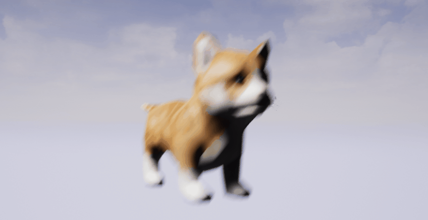
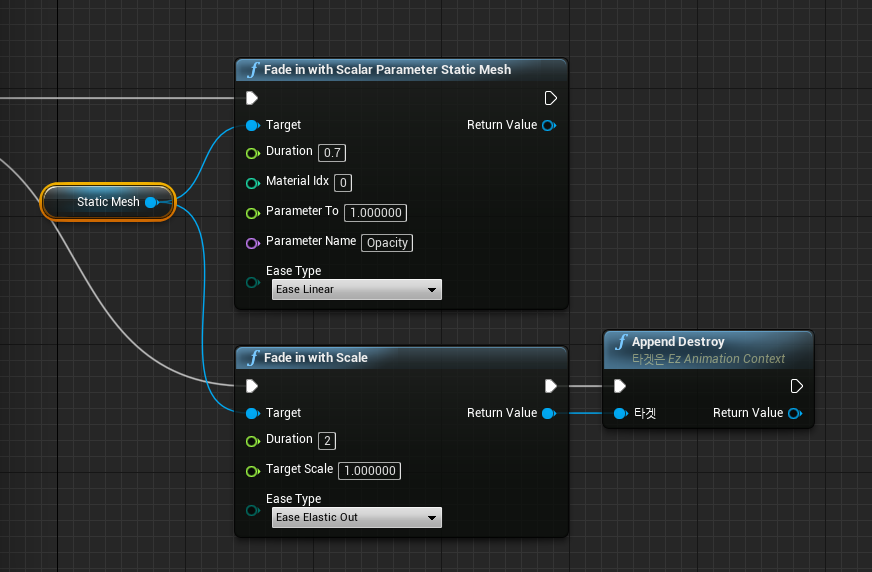

EzAnimation.ue4
====

__Easing/Animation plugin for UnrealEngine4__

<br>
  <br>
<br><br><br>

__ByBlueprint__<br>
<br>

__ByCode__
```cpp
auto ctx = UEzAnimationFunctionLibrary::FadeInWithScale(
  staticMeshComponent,
  2.0f /* duration */,
  EzEaseType::EaseElasticOut);
ctx->AppendDestroy();
```

How to install
----
just copy [this](SampleProject/Plugins/EzAnimPlugin) directory to your `Plugins` directory. (make sure you have at least c++ code in your project.)
