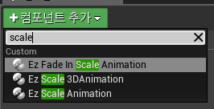
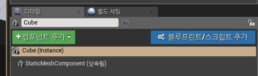
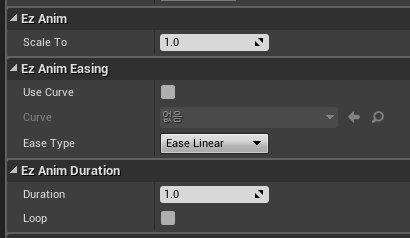

애니메이션 컴포넌트는 오브젝트의 생성과 동시에 시작되어야 하는 애니메이션들에 사용합니다. 

컴포넌트 추가하기
----
__액터 블루프린트에 추가하기__ 
 
액터에 컴포넌트를 추가하면 액터의 생성과 동시에 애니메이션이 시작됩니다.

__월드 액터에 추가하기__ 
 
별도의 블루프린트 클래스 없이도, 월드에 존재하는 액터에 바로 추가할 수 있습니다.

컴포넌트 값 설정하기
----
 
추가된 컴포넌트의 __디테일__ 패널에서 애니메이션에 관한 세부 사항들을 설정할 수 있습니다.
